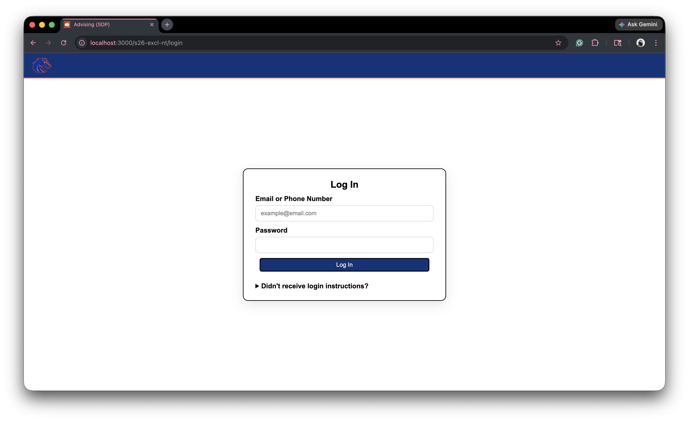
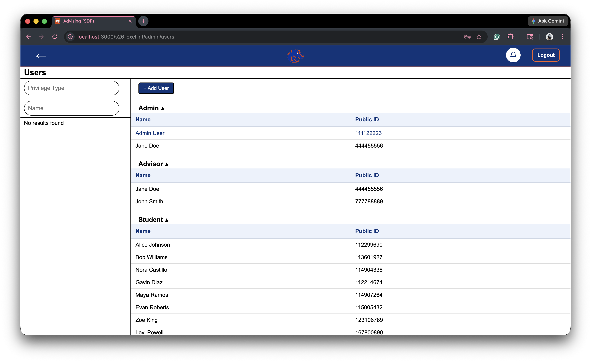
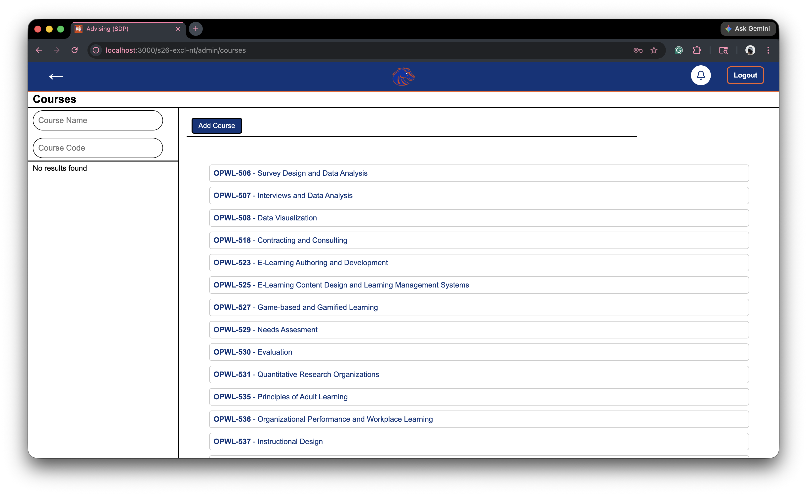
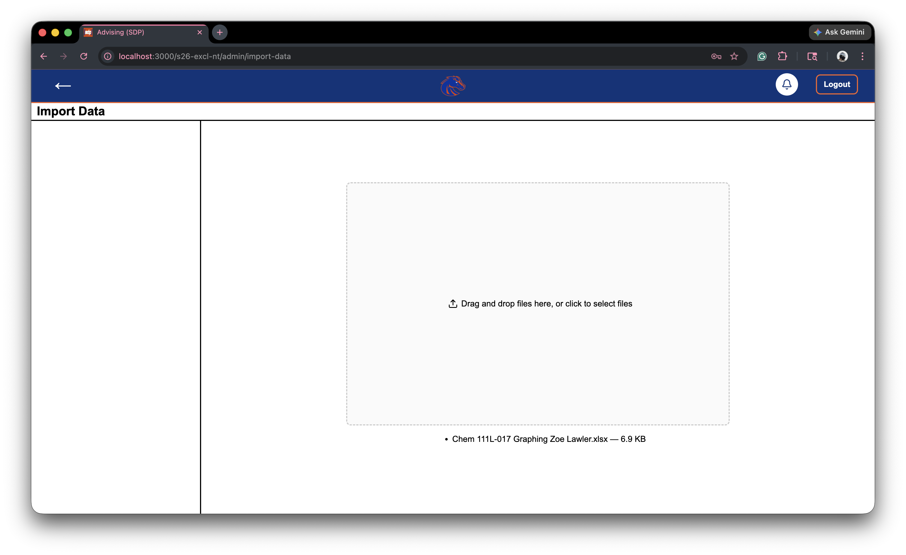
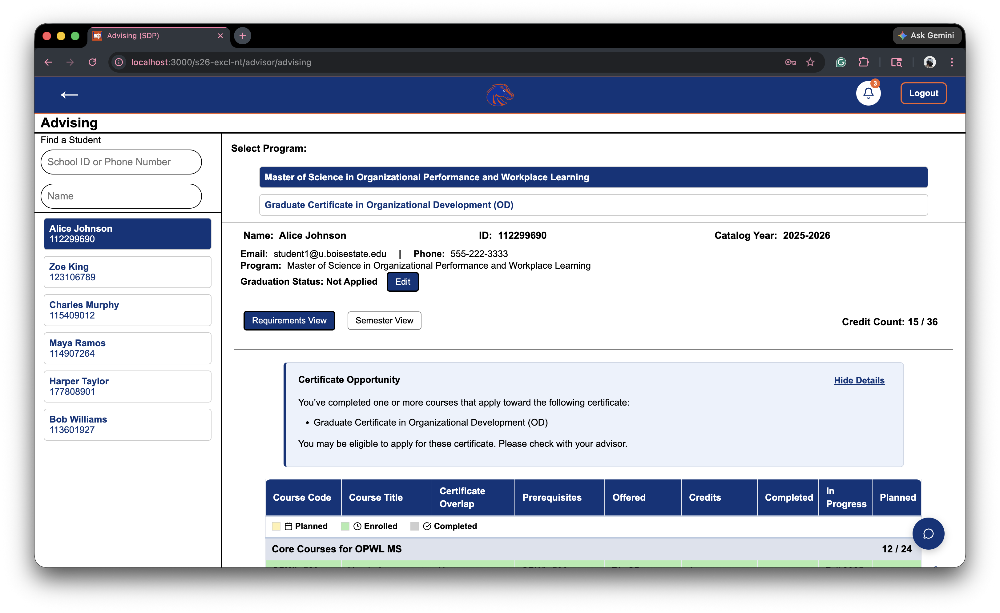
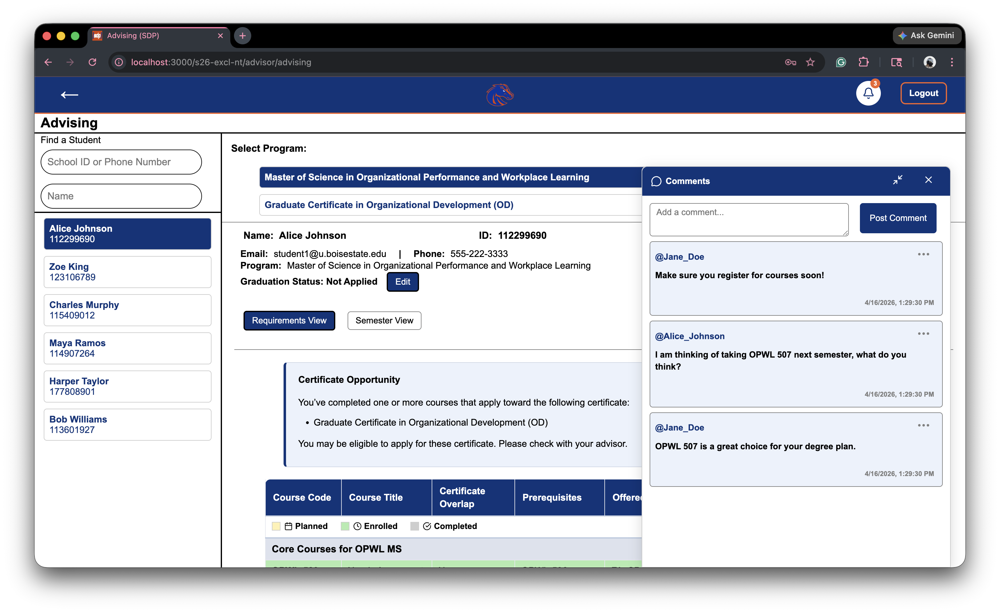

# sp26-24-excl-nt
## OPWL Degree Plan Database
### Joe Shields, Maria Gomez Baeza, Zoe Lawler

## Abstract

The Organizational Performance and Workplace Learning (OPWL) program is seeking a more effective way to track graduate students' degree plans and certificate progress. Advisors are currently using individual spreadsheets to track their students. This makes it challenging to collate data for program-level decision-making and makes it difficult for students to maintain awareness of upcoming milestones. The OPWL Planning and Advising Liaison tool (OPAL) is a web-based application designed to create and proactively maintain student degree plans in a centralized database, which will provide administrative reporting functions to facilitate course forecasting and budgetary planning. Students and advisors will have a shared view of each student's personal degree plan which will provide commenting and notification options to facilitate communication regarding changes in requirements or upcoming deadlines. The information for each student's anticipated schedule will be stored in a centralized database from which an administrator or accountant can generate global reports for enrollment numbers to predict section sizes for upcoming semesters.

## Project Description

There is currently no standardized way for advisors in OPWL to coordinate and manage degree plans, making it difficult for both advisors and students to track progress toward degrees and certificates. Additionally, there is no cohesive method for collating degree plans to anticipate enrollment numbers in future semesters.

This project addresses these challenges through the development of a web-based application designed to manage degree plans and certificates centrally. The application will allow advisors and students to easily access up-to-date information, monitor academic progress, and generate predictions for individual course needs. This centralized approach will improve visibility and organization for all users.

The application will feature a robust notification system to alert advisors and students of changes to degree plans or overarching requirements. Commenting functionality will enable direct communication on individual degree plans, supporting collaboration and clarity. Administrative users will have the ability to add and manage students and courses. In addition, built-in data analysis tools will support administrators and decision-makers in forecasting enrollment and planning course allocations for future semesters.

## Screenshots

*Log in page*

*Admin users page*

*Admin courses page*

*Admin data import page*

*Advisor degree plan page*

*Advisor degree plan comments page*
